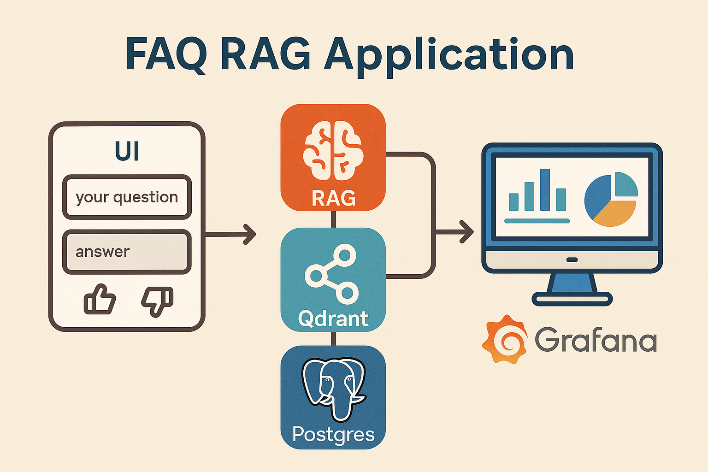

# 🧠 FAQ RAG Application

A **Retrieval-Augmented Generation (RAG)** app built with **Streamlit**, **Qdrant**, and **Postgres** — all running via **Docker Compose**.  
Users can ask questions, receive AI-generated answers  and provide feedback (👍 / 👎).  
Feedback , latency , answer relveance , cost are stored in Postgres for analytics and monitoring with Grafana.

✅ The project also includes a prebuilt Grafana dashboard, automatically provisioned when you start the stack — no manual setup required.

---


<p align="center">
  
</p>

## 🚀 Features

- **Ask questions interactively** using a Streamlit UI  
- **Qdrant** for semantic vector search  
- **Jina embeddings** (`jinaai/jina-embeddings-v2-base-en`) via FastEmbed  
- **Postgres** for storing Q&A + feedback  
- **Grafana** dashboard preconfigured for live monitoring 
- **Docker Compose** for one-command setup  
- Persistent model cache to avoid redownloading the Jina model

---

## 🧩 Project Structure

```
FAQ_RAG/
├── app.py                  # Streamlit RAG application
├── rag_core.py             # Your custom RAG logic
├── Dockerfile              # App image build
├── docker-compose.yml      # Multi-container setup
├── qdrant_storage/         # Persistent Qdrant data
├── grafana/                # Grafana provisioning/configs
├── .env                    # Environment variables (OpenAI API key, etc.)
└── README.md               # This file
```

---

## ⚙️ Requirements

- [Docker Desktop](https://www.docker.com/products/docker-desktop)
- [Python 3.12](https://www.python.org/) (for local dev with Pipenv, optional)
- Internet connection (for first model download)

---

## 🧱 Setup and Run

### 1️⃣ Clone the repository

```bash
git clone <your-repo-url>
cd FAQ_RAG
```

### 2️⃣ Create `.env` file

Create a `.env` file with your API keys:
```
OPENAI_API_KEY=your_openai_key_here
```

### 3️⃣ Build and run with Docker Compose

```bash
docker compose up --build
```

- The first run will download the Jina model (~hundreds of MBs).
- Subsequent runs reuse it from the `/tmp/fastembed_cache` volume.

### 4️⃣ Access the services

| Service    | URL                  | Description                    |
|-------------|----------------------|--------------------------------|
| Streamlit   | http://localhost:8501 | Main RAG UI                    |
| Grafana     | http://localhost:3000 | Monitoring dashboard           |
| Qdrant API  | http://localhost:6333 | Vector database REST endpoint  |
| Postgres    | localhost:5432       | Database (rag_metrics)         |

---

## 💾 Data Persistence

- **Qdrant** → stored in `./qdrant_storage`
- **Postgres** → stored in the `pgdata` named volume
- **FastEmbed / Jina model cache** → stored in `fastembed_cache` named volume
- Avoid using `docker compose down -v` unless you want to wipe everything (data + cache).

---

## 🧠 How It Works

1. User submits a question in Streamlit.  
2. The `rag()` function:
   - Embeds the question using `jinaai/jina-embeddings-v2-base-en`
   - Retrieves similar context from Qdrant
   - Generates an answer (e.g., via OpenAI API)
3. The question, answer, latency, and feedback (👍 / 👎) , cost are stored in Postgres.  
4. Grafana visualizes metrics directly from Postgres.

---

## 🪶 Example .env

```
OPENAI_API_KEY=sk-...
```

---

## 🧹 Useful Commands

| Command | Description |
|----------|-------------|
| `docker compose up --build` | Build and start all services |
| `docker compose down` | Stop containers (keep data) |
| `docker compose down -v` | Stop and **delete** volumes (wipe data + model cache) |
| `docker exec -it rag_postgres psql -U postgres -d rag_metrics` | Access Postgres shell |
| `docker exec -it rag_streamlit_app sh` | Open shell in app container |

## 🧭 Monitoring with Grafana (Prebuilt Dashboard)

Grafana is automatically provisioned when you start the stack — no manual setup required.  
The included dashboard (**`grafana/provisioning/dashboards/rag_metrics.json`**) visualizes key RAG metrics directly from the Postgres `interactions` table.

### 📊 Dashboard Panels

| Visualization | Description |
|----------------|-------------|
| **Cumulative Cost (µ$) — hourly** | A time-series graph showing the cumulative token usage cost over time (in microdollars). |
| **Spend per Hour (µ$)** | Shows the token spend per hour, helping track how usage scales with time. |
| **Average Latency (ms)** | Displays average response latency across all user interactions. |
| **Relevancy Distribution** | Pie chart of responses by relevancy label (e.g., “high”, “medium”, “low”, or “unknown”). |
| **Feedback Distribution** | Pie chart comparing counts of 👍 (helpful) and 👎 (not helpful) feedback. |
| **Recent Interactions Table** | A live table showing the latest 50 queries with their question, answer, feedback, latency, token usage, cost, and relevancy explanation. |

⏱️ The dashboard auto-refreshes every **30 seconds** and defaults to the last **7 days** of data.

### 🔧 Data Source
- **Datasource:** Postgres  
- **Database:** `rag_metrics`  
- **Table:** `interactions`

### 🔐 Access
| URL | Username | Password |
|------|-----------|-----------|
| [http://localhost:3000](http://localhost:3000) | `admin` | `admin` |


