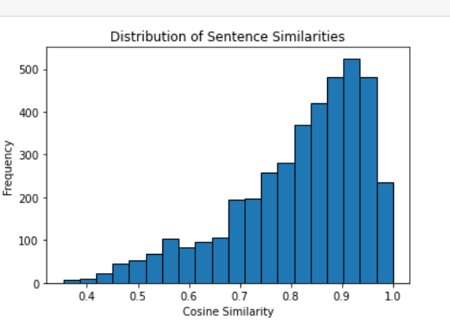

# SlackFAQ RAG Builder

📝 **Description**

SlackFAQ RAG Builder is a lightweight pipeline that ingests Slack export dumps, extracts frequently asked questions (FAQs), and stores them in a vector database to power Retrieval-Augmented Generation (RAG).  
This allows users to query historical Slack discussions and receive accurate, context-aware answers in real time.

---

## Table of Contents
- [SlackFAQ RAG Builder](#slackfaq-rag-builder)
  - [Table of Contents](#table-of-contents)
  - [Setup](#setup)
  - [Ingestion](#ingestion)
    - [1️⃣ Convert Slack standard export directory into FAQ format](#1️⃣-convert-slack-standard-export-directory-into-faq-format)
    - [2️⃣ Ingest the FAQ file into a Qdrant collection](#2️⃣-ingest-the-faq-file-into-a-qdrant-collection)
    - [Arguments](#arguments)
  - [Search](#search)
  - [Retrieval Evaluation](#retrieval-evaluation)
  - [RAG](#rag)
  - [RAG Evaluation](#rag-evaluation)
  - [App](#app)

---

## Setup

```bash
pip install pipenv
pipenv --python 3.12 install "qdrant-client[fastembed]>=1.14.2"

```


---

## Ingestion

This step processes Slack export data and extracts structured FAQ pairs for ingestion.

### 1️⃣ Convert Slack standard export directory into FAQ format

**JSON format (per item):**
```json
[
  {
    "channel": "some-channel",
    "thread_ts": "1712345678.123456",
    "qas": [
      {
        "asked_by": "alice",
        "answered_by": "bob",
        "question": "Q?",
        "answer": "A."
      }
    ]
  }
]
```

Run:
```bash
pipenv run python .\LLM\slack_threads.py .\Slack_Dump\ --out Data/slack_QA.json --extract
```

### 2️⃣ Ingest the FAQ file into a Qdrant collection

```bash
pipenv run python .\Ingest_QA.py --file Data/slack_QA.json --collection slack_dense --mode dense --skip-existing
```

### Arguments
- **--file** — path to the JSON file in the above format  
- **--skip-existing** — prevent re-ingesting duplicate documents  
- **--embed-dim** — embedding dimension (default: 768)  
- **--model** — embedding model (default: `jinaai/jina-embeddings-v2-base-en`)  
- **--collection** — name of the Qdrant collection (default: `SLACK_FAQ`)  
- **--qdrant-url** — Qdrant instance URL (default: `http://localhost:6333`)  
- **--mode** — retrieval mode: `dense`, `sparse`, or `hybrid`  

   - **sparse** → BM25  
   - **dense** → embedding-based retrieval  
   - **hybrid** → RRF Fusion combining both


---

## Search

Search the collection based on the chosen method (`sparse`, `dense`, or `hybrid`).

**From Python:**
```python
from search_qa import run_search, make_client

client = make_client()
run_search("hybrid", query, client=client)
```

**From CLI:**
```bash
pipenv run python search_qa/search.py dense "what is the schedule?"
```

---

## Retrieval Evaluation

We evaluate the retrieval performance using **Hit Rate** and **MRR** for the three methods:

| Method | Hit Rate | MRR |
|:-------|:----------|:----|
| dense  | 0.9794 | 0.8668 |
| sparse | 0.8608 | 0.6394 |
| hybrid | 0.9799 | 0.8283 |

Run evaluation:
```bash
pipenv run python .\run_evaluation.py dense
```

---

## RAG

Call RAG on the chosen method (`sparse`, `dense`, or `hybrid`).

**From Python:**
```python
from rag_core import rag
rag(query)
```

**From CLI:**
```bash
pipenv run python rag_core.py "what is attempt 1 and 2?" --method dense
```

---

## RAG Evaluation

<div style="display: flex; align-items: flex-start; gap: 30px;">

<div style="flex: 1;">

We evaluate the **"dense"** retrieval method using cosine similarity.

- **Count:** 4030  
- **Mean similarity:** 0.8166  
- **Median similarity:** 0.8480  
- **Min similarity:** 0.3534  
- **Max similarity:** 1.0000  
- **Standard deviation:** 0.1303  

[📓 Open the evaluation notebook](RAG_EVALUATION.ipynb)

</div>

<div style="flex: 1;">
  <a href="RAG_EVALUATION.ipynb">
    
  </a>
</div>

</div>

---

## App

A simple Streamlit-based interface for querying the RAG pipeline.

[📂 Open the `app` folder →](app)

<p align="center">
  
</p>
